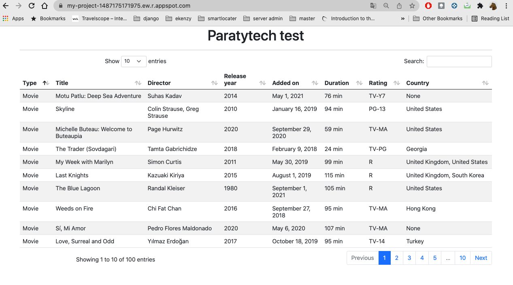

# paratytech
Job application test

This repo contains two main modules to implement the test requirements.

## system_module_1
Contains a python script that reads a csv file and sends the data to the endpoint of [system_module_2](https://github.com/yasseraj/paratytech/tree/main/system_module_2) application where data is sent and backed in Google Cloud Datastore.

To run the script, first you need to activate the virtual env and have all dependencies installed from [requirements.txt](https://github.com/yasseraj/paratytech/blob/main/system_module_1/requirements.txt), then use the CLI with following command:
```console
$ python script.py [-h] -f FILE -e ENDPOINT
```
- **File** refers to the absolute or relative path (depending on location of python binary) to the netflix_titles.csv file, Defaults to *resources/netflix_titles.csv*
- **ENDPOINT** refers to the url of the API where data should be sent to be stored in Google Cloud Datastore. Defaults to *http://localhost:8080/titles*
```console
$ python script.py -h
optional arguments:
  -h, --help            show this help message and exit
  -f FILE, --file FILE  path to input file
  -e ENDPOINT, --endpoint ENDPOINT endpoint url to post data
```

## system_module_2
Contains the implementation of an application based on Flask.
Application has two endpoints to send and query data to and from Google Cloud Datastore service.

To run the application locally, install necessary packages form [requirements.txt](https://github.com/yasseraj/paratytech/blob/main/system_module_2/requirements.txt) in virtual env.
Also, you need to set up an account in GCP, and get your Datastore credentials to be able to use the Datastore library by issuing following command:
````console
$ export GOOGLE_APPLICATION_CREDENTIALS="PATH TO CREDENTIALS JSON FILE"
````
For more information consult the GCP [docs](https://cloud.google.com/datastore/docs/reference/libraries#client-libraries-install-python).

Then run the command line:
````console
$ python main.py
````

You should be able to open the application in browser using http://localhost:8080/.

### Data query endpoint
**URL:** https://my-project-1487175171975.ew.r.appspot.com/

Expects a *limit* url query parameter which defines the maximum entries to retrieve from Datastore, defaults to 100.
The data is shown in a web page using [datatable library](https://datatables.net/).



### Post data endpoint
**URL** https://my-project-1487175171975.ew.r.appspot.com/titles

Only accepts POST requests and json formatted data otherwise throws error.
```code
@app.route('/titles', methods=['POST'])
```
Receives the data in json format, then uses the Datastore python library to create a batch operation and send the data to be stored in an *Datastore.Entity* named **Titles**.

## Improvement
The query url is very basic, it only allows querying data using one parameter, the number of entries to retrieve, witch gives very limited use to the API.
With enough time, more options should be added to the query endpoint:
- Filter entries based on user criteria
- Order entries depending on user preferences
- Pagination for a better user experience
